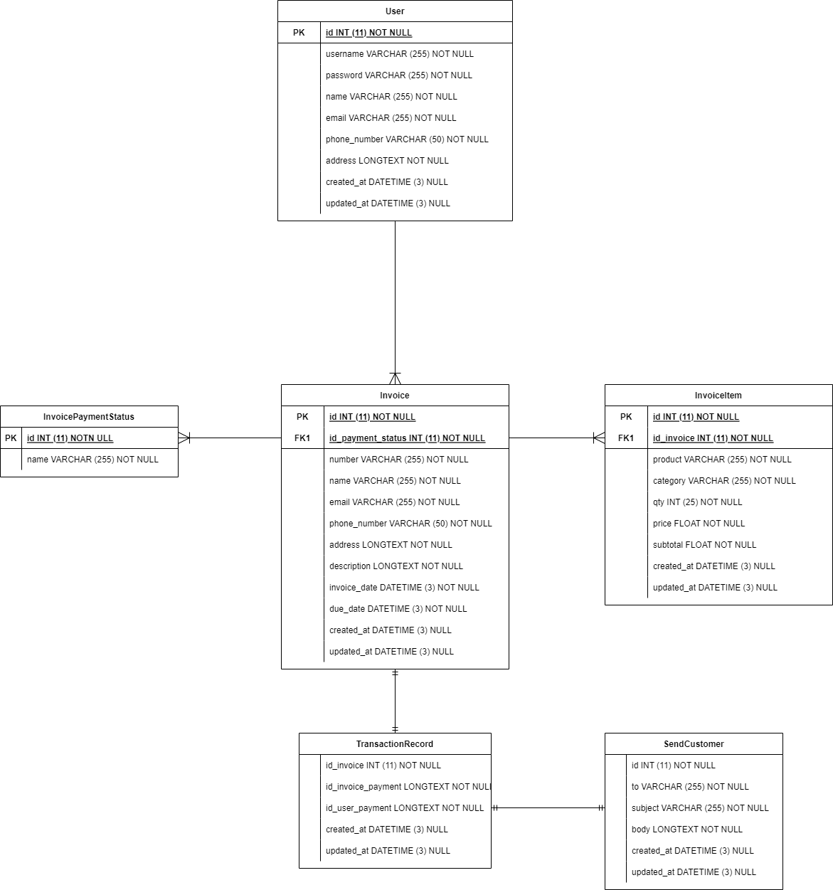

# Capstone Project : Generate Invoice System Backend

API Contract :
https://app.swaggerhub.com/apis/maderahano/generate-invoice_system_api_documentation/2.0

Tools :
- Golang
- MySQL
- GORM (Golang ORM)
- Echo (Framework/library)
- JWT (JSON Web Token)

ERD :

